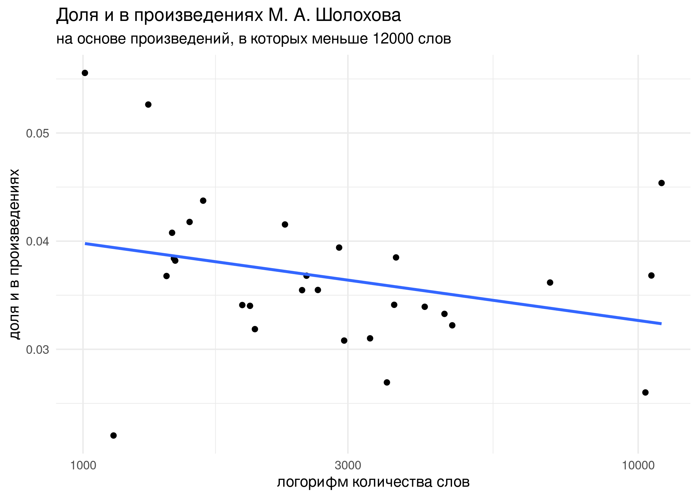

```{r, message=FALSE}
library(tidyverse)
theme_set(theme_minimal())
knitr::opts_chunk$set(message = FALSE)
```

## Задание 4.1

В датасете `tidy_sholokhov.csv` записаны тексты М. А. Шолохова. Проведите тест Стьюдента, проверяющий, является ли статистически значимой разница в длине предложений в "Тихом Доне" и других произведениях автора.

```{r}

```

Какая разница наблюдается в данных? Можете ли прокомментировать эту разницу?

## Задание 4.2

Проведите тест хи-квадрат, проверяя соотношение слов *и* и других слов в "Тихом Доне" и других текстах автора. В ответе выведите таблицу ожидаемых значений.

```{r}

```

## Задание 4.3

Отфильтруйте произведения, содержащие меньше 12000 слов, и найдите формулу регрессии, моделирующей зависимость доли слов *и* от логарифма (с основанием 10)  количества слов в произведении.

P. S. График для вашего удобства, его строить не надо.



```{r}
```

Регрессионная линия: `ratio = 0.061216 - 0.007138*log(total_words)`